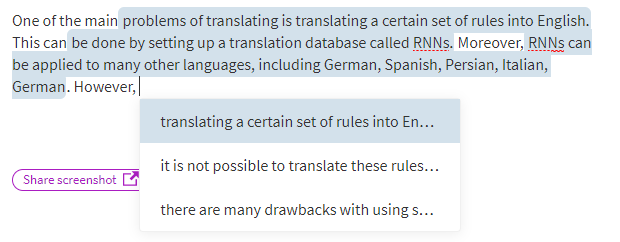

NLP
===

Most NLP problems requires a specific type of NLP model. In order to make your
life simpler I’ve added various State-of-Art NLP models and provided step by
step tutorials to complete your project, paper and research rapidly.

How to write a paper:
=====================

Let’s face it, nobody likes to edit a paper 100 times. Currently, we can use NLP
to suggest the next few sentences of scientific papers. This is a good start
since writing a paper requires a set of multi-disciplinary tools and models.

The first model is a cool tool that uses various models. Even though the model
is very general and it gives you good suggestions for next sentences.

<https://transformer.huggingface.co/doc/arxiv-nlp>

Resources
=========

[Transformer]=(<https://github.com/huggingface/transformers>)

ScatterText

Bert
